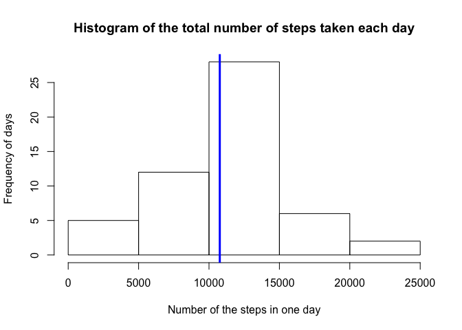
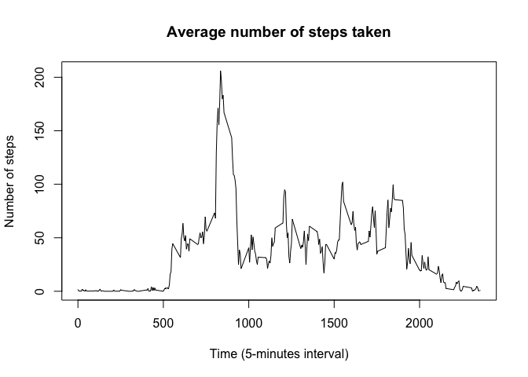
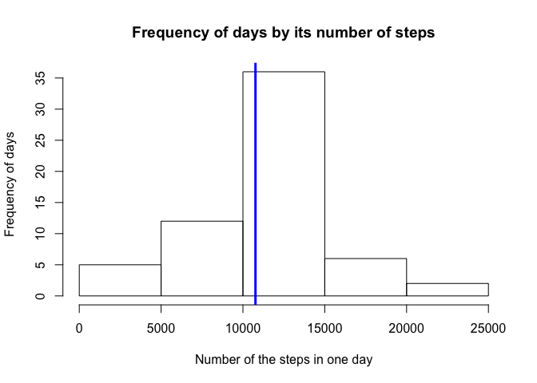
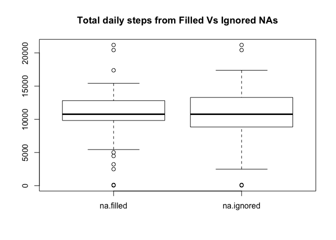
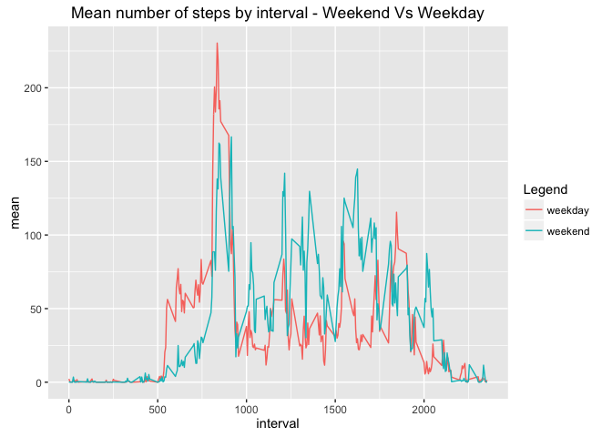

# Reproducible Research: Peer Assessment 1


## Loading and preprocessing the data

The code below set some variables concerned about the script enviroment in order
to standardize and facilitate its use.  
It also loads some general libraries that will be used on the following steps.


```r
library(dplyr)
```

```
## 
## Attaching package: 'dplyr'
```

```
## The following objects are masked from 'package:stats':
## 
##     filter, lag
```

```
## The following objects are masked from 'package:base':
## 
##     intersect, setdiff, setequal, union
```

```r
library(plyr)
```

```
## -------------------------------------------------------------------------
```

```
## You have loaded plyr after dplyr - this is likely to cause problems.
## If you need functions from both plyr and dplyr, please load plyr first, then dplyr:
## library(plyr); library(dplyr)
```

```
## -------------------------------------------------------------------------
```

```
## 
## Attaching package: 'plyr'
```

```
## The following objects are masked from 'package:dplyr':
## 
##     arrange, count, desc, failwith, id, mutate, rename, summarise,
##     summarize
```

```r
workingdirectory <- "~/R/RepData_PeerAssessment1"
zipfile.name <- "activity.zip"
csvfile.name <- "activity.csv"
files.path <- workingdirectory
zipfile.path <- paste(files.path, zipfile.name, sep = "/")
csvfile.path <- paste(files.path, csvfile.name, sep = "/")

setwd(workingdirectory)
```

As a next step it unzip and load the dataset. For this, it verifies if the file
is where expected (the zip file dataset must be provided and placed into the
specific folder as defined into the **zipfile.path** variable).
The script also checks if load/unzip step is really required once it may had 
been executed beforehand.

```r
# Check if zipfile is where expected
if (!file.exists(zipfile.path)) {
    stop(
        paste(
            "Message: The script couldn't continous because the data file was not found at '",
            zipfile.path, "'", ". Solution: place the ", zipfile.name,
            " (the one that contains the data source for this script) at ",
            files.path, " directory and try again", sep = ""
        )
    )
}

# Unzip if csv file doesn't exists
if (!file.exists(csvfile.path)) {
    unzip(zipfile.path)
}

# Read the data
activity.rawdata <-
    read.csv(
        file = csvfile.path, header = TRUE, sep = ",", stringsAsFactors = FALSE
    )
# Create a different dataframe so the raw data is preserved at its original 
# format in order to future need
activity.data <- activity.rawdata
```

From now on, it format the columns to the correct type of value


```r
# Converts steps columns into number values
if (class(activity.data$steps) != "integer") {
    activity.data$steps <- as.numeric(activity.data$steps)
}

# Converts the date column into date values
if (class(activity.data$date) != "Date") {
    activity.data$date <-
        as.Date(x = as.character(activity.data$date), format = "%Y-%m-%d")
}

# Converts the interval column into number values
if (class(activity.data$steps) != "integer") {
    activity.data$steps <- as.numeric(activity.data$steps)
}
```

The code below just bring up some additional information about the dataframe
in order to you to be familiar with its content.


```r
# Data structure info
str(activity.data)
```

```
## 'data.frame':	17568 obs. of  3 variables:
##  $ steps   : int  NA NA NA NA NA NA NA NA NA NA ...
##  $ date    : Date, format: "2012-10-01" "2012-10-01" ...
##  $ interval: int  0 5 10 15 20 25 30 35 40 45 ...
```

```r
# Percental of NA at each column
sapply(
    activity.data, FUN = function(x) {
        mean(is.na(x))
    }
)
```

```
##     steps      date  interval 
## 0.1311475 0.0000000 0.0000000
```

## What is the mean total number of steps taken per day?

To answer this question, the script executes some preparation steps in order
to preserve the clean and tidy data.set that was build by the previous code.
Thus some new variables were created and some additional cleanning data steps
executed, since all NA values will be ignored to answer the currently.


```r
# Create a new dataset with no NA value
activity.naignored <- activity.data[!is.na(activity.data$steps),]
```

The following code summarises the total number of steps for each day and 
plot the result into a histogram. Furthermore, it scratches a vertical blue line
into the graph indicating the average number of total taken steps per day.


```r
# Summarises the total daily number os steps
totalbyday.naignored <- ddply(
    activity.naignored, 
    .(date),
    summarise,
    total = sum(steps)
)

# Plots the histogram
hist(totalbyday.naignored$total,
     main = "Frequency of days by its number of steps", 
     xlab = "Number of the steps in one day",
     ylab = "Frequency of days"
)

# Adds a vertical blue line indicating the daily average number of steps
abline(v = mean(totalbyday.naignored$total), lwd = 3, col = "blue")
```



Besides the graph information below, the following code reports some numerical 
info concerned about what has been asked.


```r
# mean daily number of steps
mean(totalbyday.naignored$total)
```

```
## [1] 10766.19
```

```r
# median daily number of steps
median(totalbyday.naignored$total)
```

```
## [1] 10765
```

As you can see the average number of total daily steps is
1.0766189\times 10^{4}.

## What is the average daily activity pattern?

To answer this question the code below used the same data frame as before, 
which means that all records containing NA values were ignored.
The first step was calculates the mean number of steps of each 5-minute interval
across all days.


```r
# Calculate the mean number of steps of each 5-minute interval across all days
meanbyinterval.naignored <- ddply(
    activity.naignored, 
    .(interval), 
    summarise, 
    mean = mean(steps)
)
```
Then, it plots one graph ilustrating the mean number of steps for each 5-minutes
interval across all days.


```r
#Plot the graph with the average number of steps for each 5-minutes interval
plot(
    x = meanbyinterval.naignored$interval, 
    y = meanbyinterval.naignored$mean, 
    type = "l", 
    xlab = "Interval", 
    ylab = "Number of steps", 
    main = "Average number of steps Vs day interval"
)
```



As a complementary info, the script identifies in which 5-minutes interval
the average number of steps use to have the biggest number of steps.


```r
# Gets the 5-minutes interval which has the maximum average number of steps
# across all days
meanbyinterval.naignored[
    meanbyinterval.naignored$mean == max(meanbyinterval.naignored$mean),]
```

```
##     interval     mean
## 104      835 206.1698
```

## Imputing missing values

As you could see at the beginning of this analises, the original dataset contains
NA values. For the previous analyses, theses observations were ignored, but 
it would be interesting to check if by ignoring all these values (
``2304`` to be more precise, or 
``13.1147541``% of observations)  
we are not changing the result significantly. For this purpose the code created
a new data frame where no observation containing NA values were ignored and its
values replaced by its correspondent average number of total steps 
interval across all days.  
First, the code bellow reports the number and percental of observations 
containing NA values.


```r
# Calculate the number and percental of rows with missing values
sum(!complete.cases(activity.data))
```

```
## [1] 2304
```

```r
mean(!complete.cases(activity.data))
```

```
## [1] 0.1311475
```

Now it iterates over the data frame and replaces all NA values by it's 
correspondent mean 5-minutes interval.


```r
# Replace NA values by interval mean
activity.nafilled <- activity.data
for (i in 1:nrow(activity.nafilled)) {
        #Get the step value
        step.value <- activity.nafilled[i,"steps"]
        if (is.na(step.value)) {
            #Get the step interval
            step.interval <- activity.nafilled[i, "interval"]
            
            #Repacle step value from na by the mean step value at the correspond
            #interval
            activity.nafilled[i,"steps"] <- 
                meanbyinterval.naignored[
                    meanbyinterval.naignored$interval == step.interval, "mean"]
        }
}
# remove the variables that won't be used on the following code.
rm(step.value, step.interval)
```

Now it's time to report the results. First, the total daily number of steps
result ilustrated into a histogram which contains the same vertical blue line 
indicating the average number of daily total steps.


```r
# Calculate the total daily number of steps from activity.nafilled variable
totalbyday.nafilled <- ddply(
    activity.nafilled, 
    .(date),
    summarise,
    total = sum(steps)
)

# Plots the histogram
hist(totalbyday.nafilled$total,
     main = "Frequency of days by its number of steps", 
     xlab = "Number of the steps in one day",
     ylab = "Frequency of days"
)

# Adds a vertical blue line that marks the daily average number of steps
abline(v = mean(totalbyday.nafilled$total), lwd = 3, col = "blue")
```



Now the numeric mean and median values of total number of steps taken per day.


```r
# mean daily number of steps
mean(totalbyday.nafilled$total)
```

```
## [1] 10766.19
```

```r
# median daily number of steps
median(totalbyday.nafilled$total)
```

```
## [1] 10766.19
```

Lastly the boxplot and the summary comparison below, allows you to identify that
by ignoring or replacing NA values by its correspondent 5-minutes interval mean,
doesn't make any big difference, once that the mean value remains almost the
same. Some difference can be seen only ate the quartiles.


```r
# Plots a boxplot graph so it enables a visually comparison between ignored and 
# filled NAs values
totalbyday.nafilled <- cbind(totalbyday.nafilled, datasource = "na.filled")
totalbyday.naignored <- cbind(totalbyday.naignored, datasource = "na.ignored")
totalbyday.union <- rbind(totalbyday.nafilled, totalbyday.naignored) %>% 
    data.frame()
boxplot(
    total ~ datasource, 
    totalbyday.union, 
    main = "Total daily steps from Filled Vs Ignored NAs")
```



```r
cbind(
    na.filled = summary(totalbyday.nafilled$total), 
    na.ignored = summary(totalbyday.naignored$total)
)
```

```
##         na.filled na.ignored
## Min.           41         41
## 1st Qu.      9819       8841
## Median      10770      10760
## Mean        10770      10770
## 3rd Qu.     12810      13290
## Max.        21190      21190
```

## Are there differences in activity patterns between weekdays and weekends?

To try to answer this question the code below identified which is the weekday
of each sample. Then, it classified the weekdays into **weekend** or 
**weekday**.  
Next, it finds the mean number of steps by each 5-minutes interval across all 
days to finally plot all these data into one line graph.


```r
# Add the weekday (sun-sat) and weekdaytype (weekday or weekend) columns
activity.weekday <- cbind(
    activity.nafilled, 
    weekday = sapply(activity.nafilled$date, weekdays)
    )
activity.weekday <- cbind(
    activity.weekday, 
    weekdaytype = sapply(activity.weekday$weekday, function(x){
        if(as.numeric(x) %in% c(2,3,5,6,7) ){
            "weekday"
        }else{
            "weekend"
        }
    })
    ) %>% 
    data.frame()

# Calculate the mean number os steps by each 5-minutes interval
total.byintervalandweekday <- ddply(
    activity.weekday, 
    .(interval, weekdaytype),
    summarise,
    mean = mean(steps)
)

# Plot hte values by
library(ggplot2)
```

```
## Warning: package 'ggplot2' was built under R version 3.2.4
```

```r
ggplot(
    data = total.byintervalandweekday, 
    aes(x = interval, y = mean, color = factor(weekdaytype)),
    xlab = "Interval",
    ylab = "Mean number of steps"
) + geom_line()  + scale_color_hue(name = "Legenda") + ggtitle(label = "Mean number of steps by interval - Weekend Vs Weekday")
```



By checking out the last graph it's possible to conclude:
- People usually starts to walk after the 500 5-minutes interval
- On the weekdays the number of steps at the initial intervals is higher thant 
those at the weekend.
- Between the 800 (aprox.) and 1.000 interval, the number of steps seams to be
the highest of the day, indicating a possible running activity during this 
period of time;  
- Along all the rest of the day people walks more during the weekend than during
the weekdays, problably because at weekdays people use to be at the office,
where it's not usual to walk.
